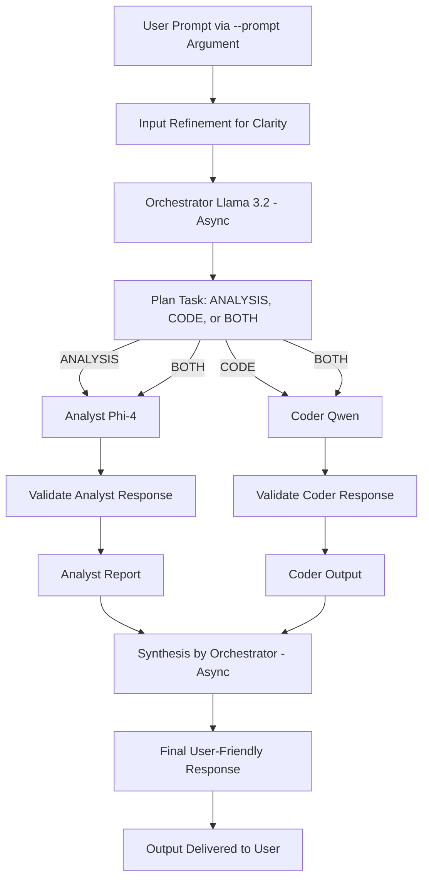

# Updated Orchestrator Agent Workflow

```mermaid
graph TD
    A[User Prompt via --prompt Argument] --> B[Input Refinement for Clarity]
    B --> C[Orchestrator Llama 3.2 - Async]
    C --> D[Plan Task: ANALYSIS, CODE, or BOTH]
    D -->|ANALYSIS| E[Analyst Phi-4]
    D -->|CODE| F[Coder Qwen]
    D -->|BOTH| E
    D -->|BOTH| F
    E --> G[Validate Analyst Response]
    F --> H[Validate Coder Response]
    G --> I[Analyst Report]
    H --> J[Coder Output]
    I --> K[Synthesis by Orchestrator - Async]
    J --> K
    K --> L[Final User-Friendly Response]
    L --> M[Output Delivered to User]
```
