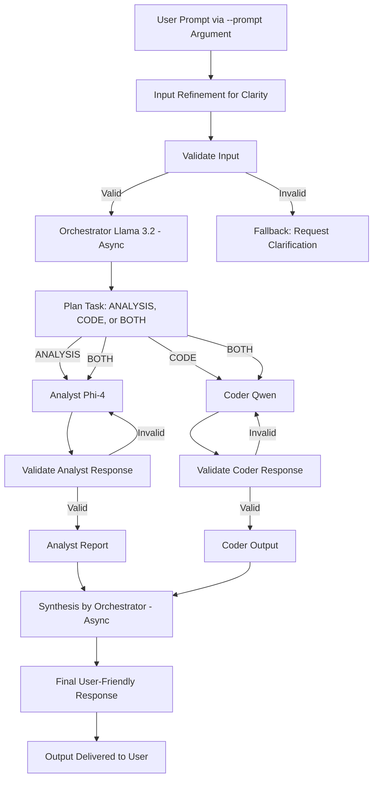

# Updated Orchestrator Agent Workflow

```mermaid
graph TD
    A[User Prompt via --prompt Argument] --> B[Input Refinement for Clarity]
    B --> C[Validate Input]
    C -->|Valid| D[Orchestrator Llama 3.2 - Async]
    C -->|Invalid| N[Fallback: Request Clarification]
    D --> E[Plan Task: ANALYSIS, CODE, or BOTH]
    E -->|ANALYSIS| F[Analyst Phi-4]
    E -->|CODE| G[Coder Qwen]
    E -->|BOTH| F
    E -->|BOTH| G
    F --> H[Validate Analyst Response]
    G --> I[Validate Coder Response]
    H -->|Invalid| F
    I -->|Invalid| G
    H -->|Valid| J[Analyst Report]
    I -->|Valid| K[Coder Output]
    J --> L[Synthesis by Orchestrator - Async]
    K --> L
    L --> M[Final User-Friendly Response]
    M --> O[Output Delivered to User]
```
